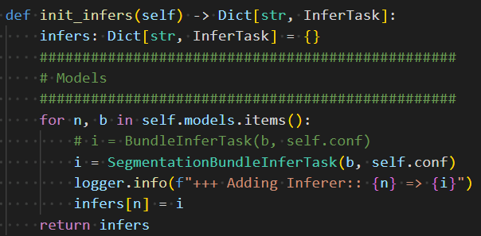
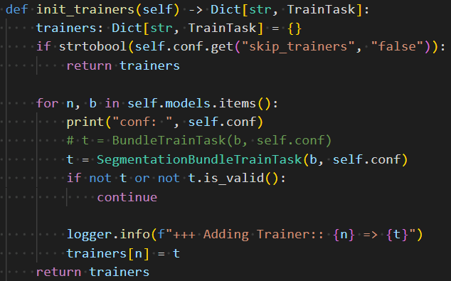
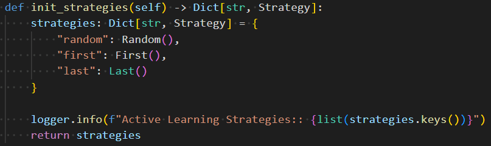

<!--
Copyright (c) MONAI Consortium
Licensed under the Apache License, Version 2.0 (the "License");
you may not use this file except in compliance with the License.
You may obtain a copy of the License at
    http://www.apache.org/licenses/LICENSE-2.0
Unless required by applicable law or agreed to in writing, software
distributed under the License is distributed on an "AS IS" BASIS,
WITHOUT WARRANTIES OR CONDITIONS OF ANY KIND, either express or implied.
See the License for the specific language governing permissions and
limitations under the License.
-->

# MONAI Bundle Application
Per the original [docs](https://github.com/Project-MONAI/tutorials/blob/main/monailabel/design_and_develop_MONAILabel_app_monaibundle_example.md)

Any MONAI Bundle used with MONAI Label must meet the following constraints:

- It must comply with the [MONAI Bundle Specification](https://docs.monai.io/en/latest/mb_specification.html).
- For inference, the bundle must define either an `inference.json` or `inference.yaml` file, and it must include the keys described in the bundle.py file located in the `monailabel/tasks/infer/` directory.
- For training, the bundle must define either a `train.json` or `train.yaml file`, and it must include the keys described in the bundle.py file located in the `monailabel/tasks/train/` directory.
- For multi-GPU training, the bundle must define either a `multi_gpu_train.json` or `multi_gpu_train.yaml` file.

These constraints ensure that any MONAI Bundle used with MONAI Label is compatible with the platform and can be seamlessly integrated into the workflow.

## Table of Contents
- [The Main.py File](#the-main-file)
- [Potential Future Changes](#potential-future-changes)

## The Main File

[segmentationMonaiLabel/apps/monaibundle/main.py](main.py)

A general main.py file is described best by the tutorial/overview here: [https://github.com/Project-MONAI/tutorials/blob/main/monailabel/design_and_develop_MONAILabel_app_monaibundle_example.md](https://github.com/Project-MONAI/tutorials/blob/main/monailabel/design_and_develop_MONAILabel_app_monaibundle_example.md)

Our main.py only differs in 3 ways:

1. [Custom BundleInferTask, SegmentationBundleInferTask](lib/infers)

2. [Custom BundleTrainTask, SegmentationBundleTrainTask](lib/trainers)

3. [Custom activelearning Strategy, last (random)](lib/activelearning)

Technically, we also get rid of some other unnecessary stuff that I believe is related to uncertainty but otherwise is the same.

## Potential Future Changes

1. Moving datastore to this folder, because having it in the root makes no sense. Would change the command to launch the server, but would allow for each app to maintain its own datastore, which would be better if we had a segmentation app, a classification app, on different types of images, etc.
2. Rename the files SegmentaionBundleInferTask.py, SegmentationBundleTrainTask.py to segmentation_bundle_train_task.py, segmentation_bundle_train_task.py to be more Pythonic (check to see how they did it in radiology example, I probably just was tired and named those files poorly. Would need to update init.py's too)
